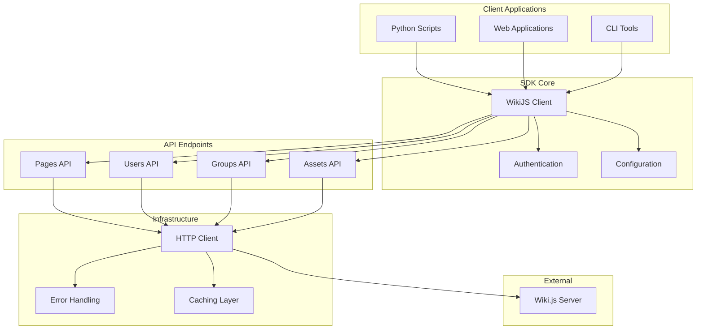
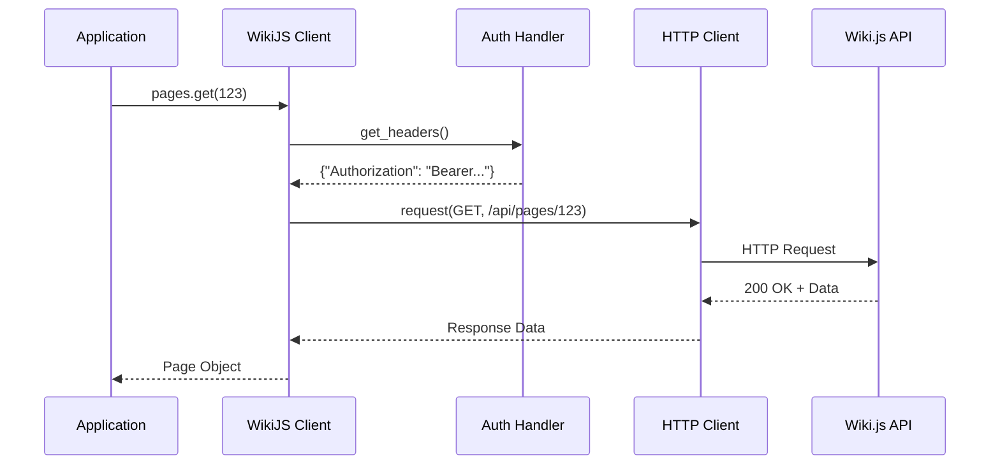
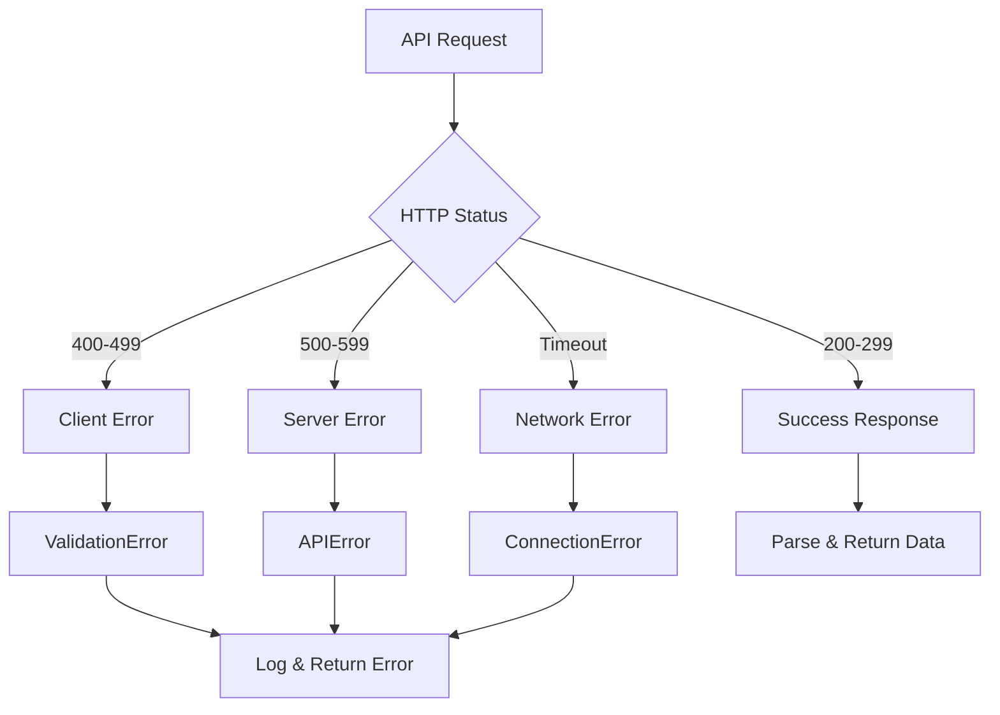

# Wiki.js Python SDK - Architecture Overview

**Version:** 1.0.0  
**Status:** MVP Design Phase  
**Date:** July 2025  

---

## 📋 Executive Summary

### Project Vision
Create a professional Python SDK for Wiki.js that provides intuitive API access, robust error handling, and enterprise-grade features through a clean, extensible architecture.

### Core Objectives
- **Developer Experience**: Intuitive, well-documented API
- **Reliability**: Built-in retry logic and graceful error handling  
- **Performance**: Efficient resource management and caching
- **Maintainability**: Clean architecture with comprehensive testing

---

## 🏗️ High-Level Architecture

### System Overview


### Architecture Principles

#### **1. Separation of Concerns**
- Authentication isolated from API communication
- Clear boundaries between endpoint handlers and HTTP transport
- Modular design allowing independent testing

#### **2. Dependency Inversion**
- Abstract interfaces for HTTP clients and authentication
- Pluggable components for caching and configuration
- Easily mockable dependencies for testing

#### **3. Fail-Fast & Graceful Degradation**
- Early validation of inputs and configuration
- Comprehensive error handling with meaningful messages
- Graceful handling of network failures

---

## 🔧 Core Components

### **WikiJS Client**
```python
class WikiJSClient:
    """Main client for Wiki.js API interactions"""
    
    def __init__(self, base_url: str, auth: AuthHandler, config: ClientConfig = None)
    
    # Properties
    .pages      # Pages API endpoint
    .users      # Users API endpoint  
    .groups     # Groups API endpoint
    .assets     # Assets API endpoint
```

**Responsibilities:**
- Central coordination of all API operations
- Authentication and configuration management
- HTTP request/response handling
- Error propagation and logging

### **Authentication System**
```python
class AuthHandler(ABC):
    """Abstract authentication interface"""
    def get_headers(self) -> Dict[str, str]
    def is_valid(self) -> bool
    def refresh(self) -> None

class APIKeyAuth(AuthHandler):
    """API key authentication implementation"""

class JWTAuth(AuthHandler):  # Future
    """JWT token authentication implementation"""
```

**Design Features:**
- Pluggable authentication strategies
- Automatic token refresh for JWT
- Header management abstraction

### **API Endpoints**
```python
class BaseEndpoint:
    """Base functionality for all API endpoints"""
    
class PagesEndpoint(BaseEndpoint):
    """Pages API operations"""
    def list(self, limit: int = 50) -> List[Page]
    def get(self, page_id: int) -> Page
    def create(self, page_data: PageCreate) -> Page
    def update(self, page_id: int, **kwargs) -> Page
    def delete(self, page_id: int) -> bool
```

**Design Features:**
- Consistent interface across all endpoints
- Type-safe request/response models
- Built-in validation and error handling

### **Data Models**
```python
class BaseModel(Pydantic.BaseModel):
    """Base model with validation and serialization"""

class Page(BaseModel):
    id: int
    title: str
    path: str
    content: str
    created_at: datetime
    updated_at: datetime
    
    # Business logic methods
    @property
    def word_count(self) -> int
    def to_markdown(self) -> str
```

**Design Features:**
- Pydantic-based validation
- Rich domain models with business logic
- Automatic serialization/deserialization

---

## 📊 Data Flow

### Request Flow


### Error Handling Flow


---

## 🗂️ Project Structure

### Directory Layout
```
wikijs-python-sdk/
├── wikijs/                    # Main package
│   ├── __init__.py           # Package entry point
│   ├── client.py             # Main client class
│   ├── exceptions.py         # Exception hierarchy
│   ├── models/               # Data models
│   │   ├── __init__.py
│   │   ├── base.py          # Base model
│   │   └── page.py          # Page model
│   ├── auth/                 # Authentication
│   │   ├── __init__.py
│   │   ├── base.py          # Auth interface
│   │   └── api_key.py       # API key auth
│   ├── endpoints/            # API endpoints
│   │   ├── __init__.py
│   │   ├── base.py          # Base endpoint
│   │   └── pages.py         # Pages API
│   └── utils/                # Utilities
│       ├── __init__.py
│       └── helpers.py       # Helper functions
├── tests/                    # Test suite
├── docs/                     # Documentation
└── examples/                 # Usage examples
```

### Module Responsibilities

| Module | Purpose | Key Classes |
|--------|---------|-------------|
| `client.py` | Main SDK interface | `WikiJSClient` |
| `exceptions.py` | Error handling | `WikiJSException`, `APIError` |
| `models/` | Data structures | `Page`, `User`, `Group` |
| `auth/` | Authentication | `AuthHandler`, `APIKeyAuth` |
| `endpoints/` | API operations | `PagesEndpoint`, `UsersEndpoint` |
| `utils/` | Helper functions | Validation, serialization |

---

## 🔌 Extensibility Design

### Plugin Architecture (Future)
```python
class Plugin(ABC):
    """Plugin interface for SDK extensions"""
    def before_request(self, request: Request) -> Request
    def after_response(self, response: Response) -> Response

class CachePlugin(Plugin):
    """Caching functionality as a plugin"""

class MetricsPlugin(Plugin): 
    """Metrics collection as a plugin"""
```

### Configuration System
```python
@dataclass
class ClientConfig:
    # Connection settings
    base_url: str
    timeout: int = 30
    verify_ssl: bool = True
    
    # Features
    cache_enabled: bool = False
    retry_enabled: bool = True
    
    # Advanced
    plugins: List[Plugin] = field(default_factory=list)
```

---

## 🚀 Development Phases

### **Phase 1: MVP (Current)**
- ✅ Core client with HTTP transport
- ✅ API key authentication  
- ✅ Pages API with full CRUD
- ✅ Basic error handling
- ✅ Type-safe models

### **Phase 2: Essential Features**
- Users, Groups, Assets APIs
- Enhanced error handling with context
- Configuration management system
- Basic CLI interface

### **Phase 3: Production Ready**
- Retry logic with exponential backoff
- Caching system with multiple backends
- Rate limiting and circuit breaker
- Performance monitoring

### **Phase 4: Enterprise Grade**
- Async support with asyncio
- Plugin architecture
- Advanced authentication (JWT, OAuth2)
- Comprehensive CLI with interactive mode

---

## 🎯 Design Decisions

### **Technology Choices**

| Component | Technology | Rationale |
|-----------|------------|-----------|
| **HTTP Client** | `requests` | Industry standard, reliable, well-documented |
| **Validation** | `pydantic` | Type safety, automatic validation, great DX |
| **Testing** | `pytest` | Powerful, flexible, extensive plugin ecosystem |
| **CLI** | `click` + `rich` | User-friendly, feature-rich, beautiful output |
| **Async** | `aiohttp` | Native asyncio support, high performance |

### **Key Architectural Decisions**

1. **Synchronous First**: Start with sync API, add async later
2. **Type Safety**: Full type hints and runtime validation
3. **Modular Design**: Clear separation of concerns
4. **Configuration**: Support both programmatic and file-based config
5. **Error Handling**: Comprehensive hierarchy with actionable messages

---

## 📈 Quality Standards

### **Code Quality**
- **Type Coverage**: 100% type hints on public APIs
- **Test Coverage**: >90% line coverage maintained
- **Documentation**: All public methods documented
- **Code Style**: Black + isort + flake8 compliance

### **Performance Targets**
- **Cold Start**: <100ms import time
- **Request Latency**: <50ms overhead per request
- **Memory Usage**: <50MB for typical workloads
- **Throughput**: >1000 req/s with connection pooling

### **Security**
- No hardcoded credentials or secrets
- Input validation on all user data
- Secure defaults for all configuration
- Regular dependency security scanning

---

*For detailed implementation specifications, see [Technical Specifications](technical/)*  
*For development tasks and coordination, see [CLAUDE.md](../CLAUDE.md)*