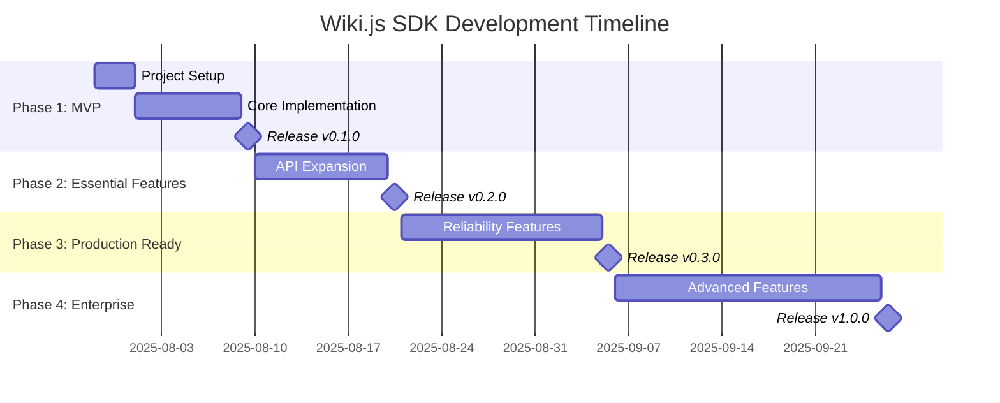

# Wiki.js Python SDK - Release Plan

**Project Name:** `py-wikijs`  
**Repository:** `https://github.com/l3ocho/py-wikijs`  
**License:** MIT  
**Target Audience:** Python developers, DevOps engineers, Data scientists  

---

## 📋 Project Overview

### Vision Statement
Develop a production-ready Python SDK for Wiki.js that evolves from a simple, functional MVP to a comprehensive enterprise-grade solution through incremental releases.

### Release Philosophy
- **MVP First**: Ship a working, useful product quickly
- **Incremental Value**: Each release adds meaningful functionality
- **Backward Compatibility**: Maintain API stability across releases
- **Community Driven**: Gather feedback and iterate

### Success Metrics
- **Adoption**: >100 PyPI downloads in first month
- **Quality**: >90% test coverage maintained
- **Community**: >10 GitHub stars, >3 contributors
- **Stability**: <1% error rate in production usage

---

## 🎯 Release Timeline

---

## 🚀 Phase 1: MVP Release (v0.1.0)

**Target:** 2 weeks from start  
**Goal:** Basic, functional Wiki.js integration

### Core Features
- **HTTP Client**: Synchronous requests with basic error handling
- **Authentication**: API key authentication
- **Pages API**: Complete CRUD operations (list, get, create, update, delete)
- **Models**: Type-safe data models with validation
- **Testing**: Comprehensive test suite with >85% coverage
- **Documentation**: API documentation and usage examples

### Success Criteria
- [ ] Package installable via `pip install git+https://github.com/l3ocho/py-wikijs.git`
- [ ] Basic page operations work with real Wiki.js instance
- [ ] >85% test coverage with passing CI/CD
- [ ] Complete API documentation

*Detailed task breakdown available in [CLAUDE.md](../CLAUDE.md)*

---

## 🔧 Phase 2: Essential Features (v0.2.0)

**Target:** 4 weeks from start  
**Goal:** Complete API coverage and enhanced usability

### Key Features
- **Complete API Coverage**: Users, Groups, Assets, System APIs
- **Enhanced Error Handling**: Detailed error context and recovery suggestions
- **Configuration System**: File-based and environment variable configuration
- **Basic CLI**: Command-line interface for common operations
- **Improved Documentation**: Comprehensive guides and examples

### Success Criteria
- [ ] All major Wiki.js APIs covered
- [ ] Configuration via files and environment variables
- [ ] Basic CLI functionality working
- [ ] >90% test coverage
- [ ] Performance benchmarks established

---

## ⚡ Phase 3: Production Ready (v0.3.0)

**Target:** 7 weeks from start  
**Goal:** Enterprise-grade reliability and performance

### Key Features
- **Retry Logic**: Exponential backoff with jitter for failed requests
- **Circuit Breaker**: Fault tolerance for unreliable connections
- **Intelligent Caching**: Multi-backend caching with smart invalidation
- **Rate Limiting**: Respect API limits and prevent abuse
- **Monitoring**: Performance metrics and health monitoring
- **Bulk Operations**: Efficient batch processing capabilities

### Success Criteria
- [ ] Production-ready reliability features
- [ ] Performance benchmarks show >50% improvement
- [ ] Cache hit ratio >80% in typical usage
- [ ] Zero-downtime error handling
- [ ] Comprehensive monitoring and logging

---

## 🌟 Phase 4: Enterprise Grade (v1.0.0)

**Target:** 11 weeks from start  
**Goal:** Full-featured enterprise SDK

### Key Features
- **Async Support**: Complete asyncio integration with aiohttp
- **Advanced CLI**: Interactive mode, progress bars, bulk operations
- **Plugin Architecture**: Extensible middleware and custom auth providers
- **Advanced Security**: JWT rotation, OAuth2, audit logging
- **Enterprise Features**: Multi-tenancy, custom headers, webhooks
- **Performance Optimizations**: Connection pooling, request batching

### Success Criteria
- [ ] Feature parity with official SDKs
- [ ] Async performance >3x sync performance
- [ ] Plugin ecosystem established
- [ ] Enterprise security features complete
- [ ] Comprehensive documentation and tutorials

---

## 📦 Deployment & Distribution

### Release Process
1. **Automated Testing**: All tests pass with quality gates
2. **Security Scanning**: Dependency and code security validation
3. **Performance Benchmarking**: Regression testing
4. **Documentation Update**: Synchronized with code changes
5. **PyPI Publishing**: Automated package distribution
6. **Gitea Release**: Tagged release with changelog

### Version Management
- **Semantic Versioning**: MAJOR.MINOR.PATCH
- **MAJOR**: Breaking changes
- **MINOR**: New features, backward compatible
- **PATCH**: Bug fixes, backward compatible

### Quality Gates
| Check | Tool | Threshold |
|-------|------|-----------|
| Tests | pytest | 100% pass |
| Coverage | pytest-cov | >90% |
| Types | mypy | 100% pass |
| Lint | flake8 | 0 errors |
| Security | bandit | 0 issues |
| Format | black | 100% formatted |

---

## 🤝 Community & Maintenance

### Community Building
- **Documentation First**: Comprehensive guides and examples
- **Issue Templates**: Structured bug reports and feature requests in Gitea  
- **Contributing Guidelines**: Clear onboarding for new contributors
- **Code of Conduct**: Inclusive community standards

### Long-term Maintenance
- **Regular Updates**: Monthly releases with improvements
- **Security Patches**: Rapid response to security issues
- **Compatibility**: Support for new Wiki.js versions
- **Performance**: Continuous optimization and monitoring

---

## 📈 Success Tracking

### Key Metrics
- **PyPI Downloads**: Measure adoption growth
- **Gitea Engagement**: Stars, forks, issues, PRs
- **Test Coverage**: Maintain >90% throughout development
- **Performance**: Response time and throughput benchmarks
- **Community**: Contributors, issue resolution time

### Milestone Reviews
- **After Each Phase**: Comprehensive retrospective
- **Process Optimization**: Improve development efficiency
- **Community Feedback**: Incorporate user suggestions
- **Technical Debt**: Address accumulated debt

---

*For detailed development tasks and coordination, see [CLAUDE.md](../CLAUDE.md)*